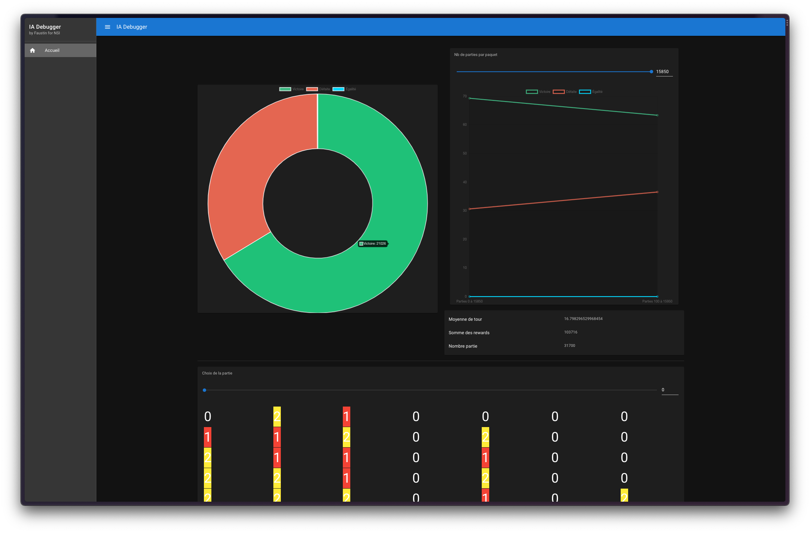

# Intelligence Artificielle Puissance 4
Ce projet d'étude est une expérimentation autour de l'intelligence artificielle et principalement des différentes méthodes pour récompenser une IA sur le jeu Puissance 4.

Ce projet n'est qu'une expérimentation de la technologie et ne permet pas une utilisation en production. Le modèle fournit n'a été entrainé que sur quelques centaines de parties. Certains de nos modèles ont affronté plus de 30 000 parties, mais nous avons observé une stagnation du niveau de l'IA avec 70% de victoire au mieux.

Il est fort probable que la qualité du jeu de donnée n'est pas permis un bon entrainement, l'ayant fait jouer contre de l'aléatoire.

## Lancement de l'entrainement
Pour lancer le projet, il faut `keras`, `numpy` et `tensorflow`. Le fichier `IAPlayer.py` correspond à la version originale, et le fichier `IAPlayer_cc.py` correspond à une expérimentation multiprocess pour accélérer considérablement la vitesse d'apprentissage.

## ia-debugger
Pour mieux comprendre le fonctionnement de l'IA, il est possible de lire les fichiers dans le dossier `logs` avec l'outil ia-debugger qui peut se lancer à l'aide de `yarn dev` ou `npm run dev` dans le dossier `ia-debugger`